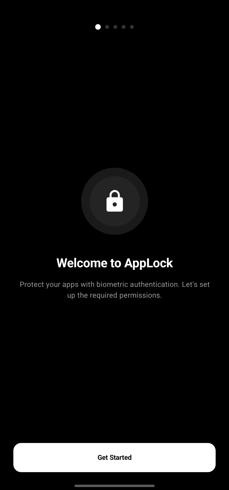
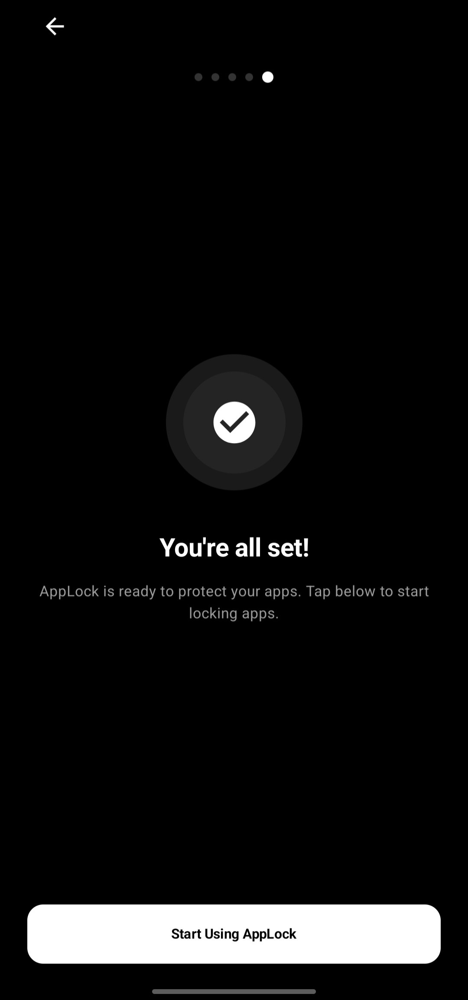
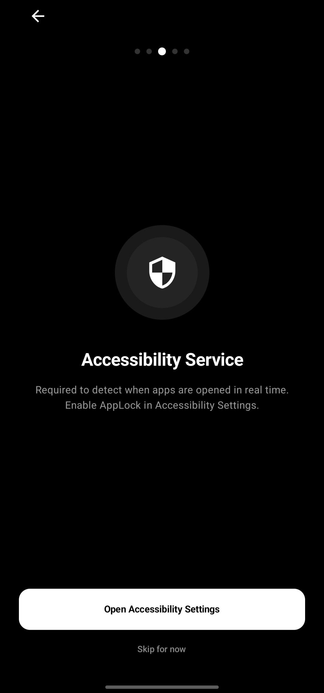

# AppLock

Biometric app protection for Android — lock any app behind fingerprint or PIN.

## The Problem

Android has no built-in way to lock individual apps. Anyone who picks up your unlocked phone can open your banking app, gallery, messages, or any sensitive app without any barrier. Existing solutions either require root access, show intrusive ads, or send your data to third-party servers.

## How AppLock Solves It

AppLock runs an accessibility service that detects the moment any protected app comes to the foreground and instantly overlays a biometric authentication screen. It uses Android's built-in BiometricPrompt — fingerprint, face unlock, or PIN — with no third-party servers involved. All data stays on device.

- Lock any installed app behind biometric or PIN authentication
- Zero-delay detection using Android Accessibility Service
- Configurable relock timeout — immediate, or a grace period of your choice
- AppLock itself is protected and locks automatically after you leave it
- Uninstall protection via Device Admin — can't be removed without authenticating first
- Protects itself from being disabled via Android Settings
- Works after reboot

## App Screenshots

  &nbsp;&nbsp;&nbsp;&nbsp;
  &nbsp;&nbsp;&nbsp;&nbsp;
  

  &nbsp;&nbsp;&nbsp;&nbsp;
  &nbsp;&nbsp;&nbsp;&nbsp;
  

## Permission Setup Guide

AppLock requires a few permissions to work correctly. The in-app onboarding walks you through each one.

  

1. **Draw Over Apps** — allows the lock screen to appear instantly on top of any app
2. **Accessibility Service** — detects when a protected app opens in real time
3. **Device Admin** — prevents AppLock from being uninstalled without authentication

## Built With

- Kotlin
- Jetpack Compose
- Android Accessibility Service
- BiometricPrompt API
- DataStore Preferences
- Device Policy Manager

## License

MIT License — feel free to use, modify, and distribute.
